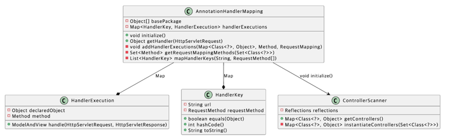

# 만들면서 배우는 스프링

[Next Step - 과정 소개](https://edu.nextstep.camp/c/4YUvqn9V)

## @MVC 구현하기

### 학습목표

- @MVC를 구현하면서 MVC 구조와 MVC의 각 역할을 이해한다.
- 새로운 기술을 점진적으로 적용하는 방법을 학습한다.

### 시작 가이드

1. 미션을 시작하기 전에 학습 테스트를 먼저 진행합니다.
    - [Junit3TestRunner](study/src/test/java/reflection/Junit3TestRunner.java)
    - [Junit4TestRunner](study/src/test/java/reflection/Junit4TestRunner.java)
    - [ReflectionTest](study/src/test/java/reflection/ReflectionTest.java)
    - [ReflectionsTest](study/src/test/java/reflection/ReflectionsTest.java)
    - 나머지 학습 테스트는 강의 시간에 풀어봅시다.
2. 학습 테스트를 완료하면 LMS의 1단계 미션부터 진행합니다.

## 학습 테스트

1. [Reflection API](study/src/test/java/reflection)
2. [Servlet](study/src/test/java/servlet)

## 1단계 - @MVC 구현하기

### 요구사항 1 - @MVC FrameWork 테스트 통과하기

> AnnotationHandlerMappingTest 클래스의 테스트가 성공하면 1단계 미션을 완료한것으로 간주
>
> Controller 인터페이스는 그대로 두고 미션을 진행

```java

@Controller
public class TestController {

    private static final Logger log = LoggerFactory.getLogger(TestController.class);

    @RequestMapping(value = "/get-test", method = RequestMethod.GET)
    public ModelAndView findUserId(final HttpServletRequest request, final HttpServletResponse response) {
        log.info("test controller get method");
        final var modelAndView = new ModelAndView(new JspView(""));
        modelAndView.addObject("id", request.getAttribute("id"));
        return modelAndView;
    }

    @RequestMapping(value = "/post-test", method = RequestMethod.POST)
    public ModelAndView save(final HttpServletRequest request, final HttpServletResponse response) {
        log.info("test controller post method");
        final var modelAndView = new ModelAndView(new JspView(""));
        modelAndView.addObject("id", request.getAttribute("id"));
        return modelAndView;
    }
}
```

- `AnnotationHandlerMapping` 클래스의 생성자 파리미터로 `basePackage` 를 넘긴다
- 생성된 `AnnotationHandlerMapping` 의 `initialize` 를 호출한다
    - `basePackage` 하위에 `@Controller` 를 가진 클래스들을 모은다
    - `Controller` 클래스들의 `@RequestMapping`이 걸린 메소드들을 모은다
    - value와 method를 가지고 `HandlerKey` 를 만든다
        - method 정보가 없으면 모든 `RequestMethod` 에 대해 만든다.
    - 메서드를 실행 시킬 수 있게 객체를와 메서드 정보를 가진 `HandlerExecution` 을 만든다
    - 만들어진 정보를 `handlerExecutions` 필드에 담는다.
- `AnnotationHandlerMapping` 의 `getHandler` 호출한다
    - 파라미터로 넘어온 request 정보로 `HandlerKey` 를 만든다.
    - 알맞는 `HandlerExecution` 를 반환한다.
        - 없으면 예외를 던진다
- `HandlerExecution` 의 `handle` 를 호출한다.
    - 만들어진 객체와 메서드정보로 메서드를 실행시킨다.

## 2단계 - 점진적인 리팩터링

### 요구사항 1 - Legacy MVC 와 @MVC 통합하기

- 컨트롤러 인터페이스 기반 MVC 프레임워크와 @MVC 프레임워크가 공존하도록 만들자.
- HandlerMapping 인터페이스를 분리한다.
    - ManualHandlerMapping, AnnotationHandlerMapping 두 가지를 묶는다.
- `DispatcherServlet` 에서 만든 `AnnotationHandlerMapping` 를 추가한다
    - ManualHandlerMapping, AnnotationHandlerMapping 를 하나의 List<HandlerMapping> 로 관리한다
- AnnotationHandlerMapping 또는 ManualHandlerMapping 클래스에서 찾은 컨트롤러를 실행한다
    - 요청 URL 에 따라 적절한 Handler 를 실행한다



- HandlerMappingRegistry
    - 각 handlerMapping 을 초기화하고, request 에 맞는 handler 를 반환한다.
- HandlerAdapterRegistry
    - handlerAdapter 들을 가지고 있다가, 요청을 공통적으로 처리한다

## 3단계 - JSON View 구현하기

### 요구사항 1 - JsonView 클래스를 구현한다.

- JSON 을 자바 객체로 변환할 때 Jackson 라이브러리를 사용한다.
- model 에 데이터가 1개면
    - 데이터가 String 이거나 Primitive or Wrapper 클래스면 그대로 반환한다. (text/plain)
    - 데이터가 String 이 아닌 객체이면 JSON 으로 변환해서 반환한다. (MediaType.APPLICATION_JSON_UTF8_VALUE)
- model에 데이터가 2개 이상이면 Map 형태 그대로 JSON 으로 변환해서 반환한다. (MediaType.APPLICATION_JSON_UTF8_VALUE)

### 요구사항 2 - Legacy MVC 제거하기

- app 모듈에 있는 모든 컨트롤러를 어노테이션 기반으로 변경한다.
- Legacy 코드를 삭제해도 서비스가 정상 작동하도록 리팩토링 한다.
- DispatcherServlet 을 mvc 패키지로 옮긴다.
- 아래 컨트롤러를 추가해서 정상 동작하지 테스트한다.

```java
@Controller
public class UserController {

    private static final Logger log = LoggerFactory.getLogger(UserController.class);

    @RequestMapping(value = "/api/user", method = RequestMethod.GET)
    public ModelAndView show(HttpServletRequest request, HttpServletResponse response) {
        final String account = request.getParameter("account");
        log.debug("user id : {}", account);

        final ModelAndView modelAndView = new ModelAndView(new JsonView());
        final User user = InMemoryUserRepository.findByAccount(account)
                .orElseThrow();

        modelAndView.addObject("user", user);
        return modelAndView;
    }
}
```
